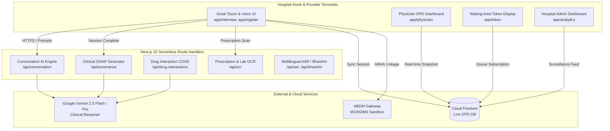
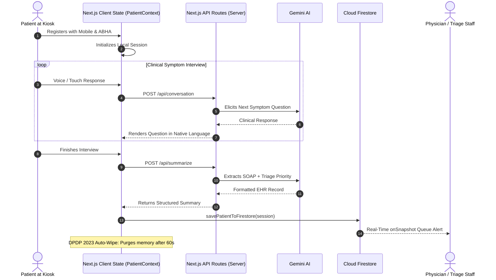

# MediKiosk Technical Architecture & Database Specification

This document provides an end-to-end breakdown of the **Backend Architecture**, **API Pipelines**, **Cloud Firestore Database Structure**, and **Data Security Lifecycle** of the MediKiosk platform.

---

## 1. High-Level System Architecture

MediKiosk utilizes a hybrid edge-and-cloud architecture designed for hospital kiosk environments (intermittent connectivity, high throughput, and patient privacy compliance).



---

## 2. Cloud Firestore Database Structure

Data is organized under a root collection **`opd_sessions`** with modular sub-objects, alongside supporting collections for epidemiology and department routing.

### 2.1 Primary Collection: `/opd_sessions/{sessionId}`
Each document represents a single patient encounter (e.g. `MK-001`, `MK-1726099201`).

```json
{
  "id": "MK-001",
  "facilityCode": "DL-ND-AIIMS-001",
  "terminalId": "KIOSK-TERMINAL-04",
  "timestamp": "2026-09-12T05:15:00.000Z",
  "updatedAt": "2026-09-12T05:18:22.000Z",

  // 1. Patient Demographics & Identification
  "patient": {
    "name": "Rajesh Kumar",
    "age": 45,
    "gender": "M",
    "phone": "+91 98765 43210",
    "email": "rajesh.kumar@example.com",
    "preferredLanguage": "hi",
    "abhaId": "23-8841-9021-3412",
    "abhaStatus": "verified"
  },

  // 2. Triage & Department Routing
  "triage": {
    "acuityLevel": "routine",           // "routine" | "urgent" | "emergency"
    "department": "General Medicine",
    "esiScore": 4,                      // Emergency Severity Index (1 to 5)
    "redFlags": [],                     // e.g. ["Severe Chest Pain", "SpO2 < 94%"]
    "assignedRoom": "OPD-1",
    "assignedDoctor": "Dr. Rajesh Sharma, MD"
  },

  // 3. Raw Complaint & Multimodal Conversation Transcript
  "chiefComplaint": "Fever and generalized myalgia for 3 days",
  "transcript": [
    {
      "role": "assistant",
      "text": "नमस्ते राजेश जी, आपको बुखार कितने दिनों से है और क्या साथ में कंपकंपी भी है?",
      "timestamp": "2026-09-12T05:15:10.000Z"
    },
    {
      "role": "user",
      "text": "मुझे 3 दिन से तेज बुखार है और बदन में बहुत दर्द है।",
      "timestamp": "2026-09-12T05:15:22.000Z"
    }
  ],

  // 4. Clinical Structured SOAP Summary (Generated by AI)
  "summary": {
    "chiefComplaint": "High-grade fever with generalized body aches × 3 days",
    "hpi": "Continuous fever (100-102°F) accompanied by dull aching myalgia and headache. Partially responsive to OTC antipyretics.",
    "pastHistory": "Known case of Type 2 Diabetes Mellitus × 4 years on Metformin.",
    "drugHistory": [
      { "name": "Metformin", "dosage": "500mg BD", "duration": "4 years" }
    ],
    "allergyHistory": "NKDA (No Known Drug Allergies)",
    "familyHistory": "Father: T2DM & Hypertension. Mother: Healthy.",
    "personalHistory": "Non-smoker, non-alcoholic, sedentary desk job.",
    "reviewOfSystems": {
      "positive": ["Fever", "Myalgia", "Headache", "Anorexia"],
      "negative": ["Cough", "Dyspnea", "Rash", "Chest Pain", "Bleeding Diathesis"]
    }
  },

  // 5. Scanned Reports & OCR Investigations
  "investigations": {
    "scannedDocsCount": 1,
    "labValues": [
      {
        "test": "Platelet Count",
        "value": "1.42",
        "unit": "Lakh/mcL",
        "referenceRange": "1.5 - 4.5",
        "isAbnormal": true
      },
      {
        "test": "HbA1c",
        "value": "7.1",
        "unit": "%",
        "referenceRange": "< 5.7",
        "isAbnormal": true
      }
    ]
  },

  // 6. Automated Follow-Up & 2-Day Pre-Appointment Reminder
  "followUp": {
    "appointmentDate": "2026-09-19T05:15:00.000Z",
    "reminderDate": "2026-09-17T05:15:00.000Z", // Exactly 48 hours prior
    "department": "General Medicine",
    "doctorName": "Dr. Rajesh Sharma, MD",
    "remarks": "Review defervescence and finish prescribed course. Repeat CBC if fever persists.",
    "reminderStatus": "scheduled_2_days_prior",
    "channels": {
      "sms": true,
      "email": true,
      "push": true
    }
  },

  // 7. Comparative Clinical Recovery Tracker (Filled on Revisit)
  "recovery": {
    "baselineScore": 35,
    "currentScore": 85,
    "painLevelBefore": 8,
    "painLevelNow": 2,
    "symptomDeltas": [
      { "symptom": "Fever", "before": "Continuous 102°F", "now": "Afebrile (98.4°F)", "status": "resolved" },
      { "symptom": "Myalgia", "before": "Severe incapacitating", "now": "Mild residual soreness", "status": "improved" }
    ],
    "physicianRemarks": "Patient showing robust recovery. Vital signs stable.",
    "evaluatedAt": "2026-09-19T06:00:00.000Z"
  },

  // 8. AYUSH Standardized Integration (When applicable)
  "ayush": {
    "prakriti": "Vata-Kapha",
    "agni": "Vishamagni",
    "doshaImbalance": "Vata-Pitta Prakopa",
    "prescribedTherapy": "Snehana, Swedana, Pathya-Apathya lifestyle regimen"
  }
}
```

---

### 2.2 Supporting Collections

| Collection Path | Purpose | Schema Summary |
| :--- | :--- | :--- |
| **`/surveillance_metrics/{date}`** | National Disease Surveillance Program (IDSP) syndromic tracking | `{ date, feverSurgeCount, aqiCorrelatedCases, ncdHypertensionCluster, topDiagnoses: [] }` |
| **`/hospital_departments/{deptId}`** | Live Room Availability & Queue Depths | `{ deptName, roomNumber, doctorOnDuty, waitingTokens: [], avgConsultTimeMin }` |

---

## 3. Backend Architecture: Server-Side Route Handlers

All clinical AI reasoning and secret credentials execute in isolated **Next.js Serverless Route Handlers**. The browser never makes direct third-party calls.

```
app/api/
├── conversation/route.js    --> Adaptive clinical dialogue & symptom elicitation
├── summarize/route.js       --> Structured SOAP generation & ESI triaging
├── drug-interactions/route.js -> Clinical Decision Support (CDSS) safety engine
├── ocr/route.js             --> Prescription & lab report OCR extraction
├── asr/route.js             --> Multilingual speech recognition
└── bhashini/route.js        --> National language translation (Bhashini SDK)
```

### 3.1 Adaptive Conversation Pipeline (`/api/conversation`)
- **Input**: `{ history: [...], userInput: string, language: string, complaint: string }`
- **Logic**:
  1. Validates input and sanitizes text.
  2. Runs real-time keyword + clinical heuristic checks for **emergency red flags** (e.g., crushing chest pain, anaphylaxis, severe stridor).
  3. Formats clinical prompting instructions enforcing:
     - 1-2 focused clinical questions per turn.
     - Preferred patient language (Hindi, Bengali, Marathi, Tamil, etc.).
     - Empathetic bedside manner with age-appropriate vocabulary.
  4. Calls **Gemini 2.5 Flash** with low latency.
- **Output**: `{ reply: string, isComplete: boolean, redFlagsDetected: string[] }`

### 3.2 SOAP Summary Pipeline (`/api/summarize`)
- **Input**: `{ transcript: [...], patient: {...}, complaint: string }`
- **Logic**:
  1. Assembles complete interview history and demographic vitals.
  2. Directs Gemini to produce structured JSON matching the hospital EHR schema:
     - HPI, Past History, Drug History, Allergies, Family History, ROS.
     - ESI Priority Recommendation (`emergency` / `urgent` / `routine`).
     - Best matching tertiary department (`Cardiology`, `Orthopedics`, `AYUSH`, etc.).
- **Output**: Formatted JSON conforming to FHIR / ABDM health record specifications.

### 3.3 Drug-Drug Interaction Pipeline (`/api/drug-interactions`)
- **Input**: `{ currentMedications: string[], newPrescription: string[] }`
- **Logic**:
  - Compares drug classes for CYP450 enzyme conflicts, additive QT prolongation, NSAID + Anticoagulant bleeding risks, and duplicate therapies.
- **Output**: `{ hasInteraction: boolean, severity: "critical"|"moderate"|"none", advisory: string }`

---

## 4. State Management & Lifecycle



---

## 5. Security & Compliance Architecture

| Security Layer | Implementation Mechanism | Purpose |
| :--- | :--- | :--- |
| **Zero-Trust Firestore Rules** | `firestore.rules` | Enforces role-based read/write access. Prevents unauthorized reads of medical histories; completely disables record deletion (`allow delete: if false`). |
| **API Key Isolation** | `.env.local` & Server Routes | `GEMINI_API_KEY` is strictly held on the server side and never sent to client browsers. |
| **DPDP Act 2023 Session Wipe** | `app/summary/page.js` | Public kiosks automatically purge memory and `localStorage` after 60 seconds of inactivity to protect subsequent patients. |
| **Data Encryption** | Google Cloud / Firestore TLS 1.3 & AES-256 | All data in transit is encrypted via HTTPS; stored Firestore documents are encrypted at rest with AES-256. |
| **ABDM M1/M2/M3 Interoperability** | `lib/firebase.js` & Schema | Formatted to map directly to Ayushman Bharat Digital Mission (ABDM) FHIR bundles for interoperable record sharing. |
