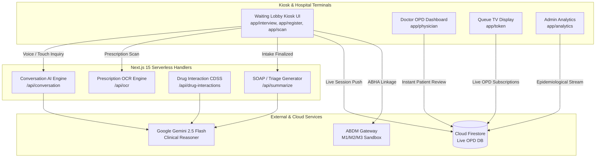

# MediKiosk — AI-Powered Patient Case-Taking & Triage Platform

<div align="center">


**An AI-Powered, Multilingual, Multimodal Clinical Pre-Consultation & Triage Kiosk for Indian Hospital OPDs**

[Smart India Hackathon 2026](#smart-india-hackathon-2026-details) • [Features](#key-features) • [File Structure](#file-structure) • [Installation & Setup](#getting-started) • [Architecture](#system-architecture)

</div>

---

## 🏆 Smart India Hackathon 2026 Details

| Parameter | Specification |
| :--- | :--- |
| **Competition** | **Smart India Hackathon (SIH) 2026** |
| **Problem Statement ID** | **26047** |
| **Problem Statement Title** | **Patient Case Taking Software** |
| **Theme** | **HealthTech / MedTech** |
| **Team Name** | **HEXABYTES (Team 020)** |
| **Institution** | **JAIN (Deemed-to-be University)** |

---

## 👥 Team HEXABYTES (Team 020)

| Member Name | Role & Core Contributions |
| :--- | :--- |
| **Vishad Jain** | Full-Stack Architecture, AI Engine, Cloud Infrastructure & Integration |
| **Mihir Saurabh** | Frontend Engineering, Clinical UI/UX, Component Architecture |
| **Jaywantrao Nikam** | Backend API Pipelines, OCR & Multimodal Document Processing |
| **Aniska Rai** | Clinical Workflow Design, ESI Triage Logic, Medical Validation |
| **Ekta Patel** | Multilingual & Vernacular Speech Pipelines (Bhashini/ASR), Accessibility |
| **Shubham Kumar Pathak**| Quality Assurance, ABDM FHIR Standards, Security & DPDP Compliance |

---

## 🌟 Problem Overview

In Indian public and government hospital Outpatient Departments (OPDs), clinicians often consult **80 to 120+ patients in a single shift**, leaving barely **2 to 3 minutes per patient**. A significant portion of this limited consultation window is consumed by repetitive administrative inquiries—asking for symptoms, deciphering handwritten past prescriptions, re-recording medical history, and transcribing vitals.

### The Solution: MediKiosk
**MediKiosk** is a self-service, multilingual kiosk placed in OPD waiting areas that interacts with incoming patients using conversational speech in their native language (Hindi, Bengali, Tamil, Telugu, Marathi, Gujarati, English, etc.) and intuitive touch chips. 

Before the patient walks into the doctor's room:
1. An automated **SOCRATES-standard clinical intake** is conducted.
2. Past prescriptions, lab reports, and doctor slips are **digitized via OCR**.
3. A standardized **FHIR-compliant SOAP dossier** is formulated with automated **Emergency Severity Index (ESI)** triage scoring.
4. The attending physician receives the structured briefing on their OPD terminal instantly, reducing administrative intake from **3 minutes to 30 seconds**.

---

## 🚀 Key Features

- 🗣️ **Vernacular Speech Case-Taking**: Voice-driven conversational AI supporting 12+ Indian regional languages powered by Google Gemini and Bhashini speech models, with tactile emoji touch-chip fallbacks for noisy hospital lobbies.
- 📄 **Multimodal Paper & Prescription OCR**: Live camera capture or file upload that reads handwritten prescriptions, diagnostic tests, and past OPD slips, auto-populating active medications and allergies.
- 🩺 **Automated ESI Triage & Red-Flag Escalation**: Two-tier safety regex immediately detects chest pain, stroke signs, anaphylaxis, or acute distress, triggering instant visual alerts and audio escalation.
- 📋 **Doctor's OPD Dashboard**: Real-time terminal for physicians to review patient SOAP summaries, accept/override AI impressions, conduct drug-drug interaction cross-checks, and electronically sign off with a single tap.
- 📺 **Live OPD Queue TV Display (`/token`)**: Dynamic waiting hall queue screen with rotating audio announcements, token numbers, triage badges, and estimated wait times.
- 📈 **Post-Visit Recovery Tracking & 2-Day Alerts**: Visualizes patient symptom reduction between visits (Initial vs. Follow-up), equipped with automated 48-hour pre-appointment reminders via SMS, WhatsApp, and push notifications.
- 🌿 **AYUSH Prakriti Assessment**: Integrated traditional Indian medicine questionnaire calculating Vata, Pitta, and Kapha bio-energetic constitutions.
- 🔒 **DPDP Act 2023 & Zero-Retention Compliance**: Session data is encrypted, linked to ABHA ID, and purged from public terminal memory following patient handoff.
- 🎨 **Adaptive Color Themes**: Dual high-contrast medical palettes (**Slate Navy** `#1E293B` and **Medical Teal** `#00D4AA`) designed for hospital ambient lighting.

---

## 📁 File Structure

```
SIH/
├── app/                                 # Next.js App Router Pages & API Routes
│   ├── layout.js                        # Global Root Layout & Metadata
│   ├── globals.css                      # Master Design System, CSS Variables & Tokens
│   ├── page.js                          # Welcome & Multilingual Language Selector Screen
│   ├── register/page.js                 # Patient Demographics & ABHA ID Registration
│   ├── interview/page.js                # AI Clinical Voice & Touch-Chip Case-Taking
│   ├── scan/page.js                     # Prescription & Lab Document OCR Scanner
│   ├── summary/page.js                  # Clinical SOAP Dossier & QR Token Generator
│   ├── physician/page.js                # Doctor OPD Review & ESI Triage Portal
│   ├── token/page.js                    # Waiting Area Live Queue TV Display
│   ├── analytics/page.js                # Hospital Admin OPD Surveillance Dashboard
│   ├── ayush-assessment/page.js         # AYUSH Prakriti Bio-constitution Quiz
│   └── api/                             # Secure Serverless Route Handlers
│       ├── conversation/route.js        # Gemini Dynamic Socrates AI Question Engine
│       ├── summarize/route.js           # Structured FHIR/SOAP Clinical Synthesis
│       ├── drug-interactions/route.js   # Real-time Multi-Drug CDSS Interaction Check
│       ├── ocr/route.js                 # Prescription Image/PDF Document Extraction
│       ├── asr/route.js                 # Regional Speech-to-Text Processing
│       └── bhashini/route.js            # National Language Translation Pipeline
│
├── components/                          # Reusable UI & Functional Components
│   ├── ui/
│   │   ├── Navbar.jsx                   # Main Navigation Bar with Quick Route Links
│   │   ├── GlassCard.jsx                # Premium Backdrop-Filtered Card Container
│   │   └── LoadingPulse.jsx             # Medical Heartbeat Loading Indicator
│   ├── VoiceRecorder.jsx                # Multilingual Speech Recognition & Synthesis
│   ├── DocumentUpload.jsx               # Drag-and-Drop / Camera OCR File Handler
│   ├── CameraCapture.jsx                # Live Kiosk Webcam Capture Modal
│   ├── QRToken.jsx                      # Client-side Dynamic Token Generator
│   ├── PatientRecoveryGraph.jsx         # Longitudinal Symptom Trajectory Visualizer
│   ├── AppointmentReminderModal.jsx     # Follow-up Scheduling & 48h Alert Trigger
│   ├── RiskScoreCard.jsx                # ESI Acuity & Vital Urgency Visualizer
│   ├── ToneSwitcher.jsx                 # Dual Slate Navy / Medical Teal Switcher
│   └── Providers.jsx                    # Tone & Patient Context Providers
│
├── context/                             # Global Client State Management
│   ├── PatientContext.jsx               # Live Patient Intake, Vitals & SOAP State
│   └── ToneContext.jsx                  # Persistent UI Color Theme State
│
├── lib/                                 # Business Logic & External Integrations
│   ├── firebase.js                      # Cloud Firestore Live Synchronization Client
│   ├── gemini.js                        # Google Gemini 2.5 Flash SDK Wrapper
│   ├── clinical-schema.js               # Validated ESI, SOCRATES & SOAP Schemas
│   ├── fhir-export.js                   # ABDM FHIR Bundle Generator (M1/M2/M3)
│   ├── languages.js                     # Indian Vernacular TTS, ASR & Audio Cues
│   ├── reminders.js                     # 2-Day Pre-Alert & Recovery Simulation Logic
│   └── prompts.js                       # Clinical Safety & Interview Prompts
│
├── .env.example                         # Environment Variables Template
├── .eslintrc.json                       # ESLint Configuration for Next.js
├── next.config.mjs                      # Next.js Build & Environment Configuration
├── package.json                         # Dependencies & Project Metadata
└── ARCHITECTURE.md                      # Comprehensive Technical & Database Spec
```

---

## 🛠️ Tech Stack

- **Framework**: [Next.js 15](https://nextjs.org/) (App Router, Server Actions, Route Handlers)
- **UI & Components**: [React 19](https://react.dev/), Vanilla CSS (Modern Design Tokens, Glassmorphism, HSL Palette)
- **Icons**: [Lucide React](https://lucide.dev/)
- **AI / LLM**: [Google Gemini 2.5 Flash](https://aistudio.google.com/) via `@google/generative-ai`
- **Speech & Vernacular**: Web Speech Recognition API, Bhashini Gateway integration
- **Database / Cloud**: [Firebase Cloud Firestore](https://firebase.google.com/) (Real-time sync across Kiosk, Doctor Portal & Queue Display)
- **Standards & Formats**: HL7 FHIR (Fast Healthcare Interoperability Resources), Ayushman Bharat Digital Mission (ABDM) M1/M2/M3 Sandbox specifications

---

## ⚙️ Getting Started

### Prerequisites
- **Node.js**: `v20.x` or `v22.x` recommended
- **npm**: `v9.x` or higher
- **Google Gemini API Key**: Obtain a free API key from [Google AI Studio](https://aistudio.google.com/apikey)

### 1. Clone the Repository
```bash
git clone https://github.com/Inf3rno26/Patient-Case-Taking-Software-SIH202.git
cd Patient-Case-Taking-Software-SIH202
```

### 2. Install Dependencies
```bash
npm install
```

### 3. Configure Environment Variables
Create a `.env.local` file in the root directory:
```bash
cp .env.example .env.local
```
Add your credentials:
```env
# Gemini API Key (Required for AI Clinical Reasoner)
GEMINI_API_KEY=your_gemini_api_key_here

# Application Name
NEXT_PUBLIC_APP_NAME=MediKiosk

# Firebase Configuration (Optional - for real-time Cloud Firestore sync)
NEXT_PUBLIC_FIREBASE_API_KEY=your_firebase_api_key
NEXT_PUBLIC_FIREBASE_AUTH_DOMAIN=your_project.firebaseapp.com
NEXT_PUBLIC_FIREBASE_PROJECT_ID=your_project_id
NEXT_PUBLIC_FIREBASE_STORAGE_BUCKET=your_project.appspot.com
NEXT_PUBLIC_FIREBASE_MESSAGING_SENDER_ID=your_sender_id
NEXT_PUBLIC_FIREBASE_APP_ID=your_app_id
```

### 4. Run the Development Server
```bash
npm run dev
```
Open your browser and navigate to **`http://localhost:3000`**.

### 5. Build for Production
```bash
npm run build
npm start
```

---

## 🌐 Deploying to Vercel

1. Push your latest code to GitHub:
   ```bash
   git push origin main
   ```
2. Import the repository into **[Vercel](https://vercel.com/)**.
3. Under **Project Settings $\rightarrow$ Environment Variables**, configure:
   - `GEMINI_API_KEY`: *(Your Google AI Studio Gemini API Key)*
   - `NEXT_PUBLIC_APP_NAME`: `MediKiosk`
4. Click **Deploy**. Vercel will build and host your production instance with zero configuration required.

---

## 🏛️ System Architecture



---

## 🛡️ Security, Privacy & Compliance

- **Physician-in-the-Loop (PitL)**: The AI is an intake assistant and never prescribes medication directly. Every summary, triage tag, and assessment requires explicit physician review and electronic sign-off.
- **DPDP Act 2023 Adherence**: All patient identifiable data stored on client devices is wiped using automated 60-second retention timers.
- **ABDM Standards**: SOAP notes format directly into standard HL7 FHIR diagnostic report bundles, ready for seamless linkage with Ayushman Bharat Health Accounts (ABHA).

---

<div align="center">

**Developed with ❤️ by Team HEXABYTES for Smart India Hackathon 2026**

*JAIN (Deemed-to-be University)*

</div>
